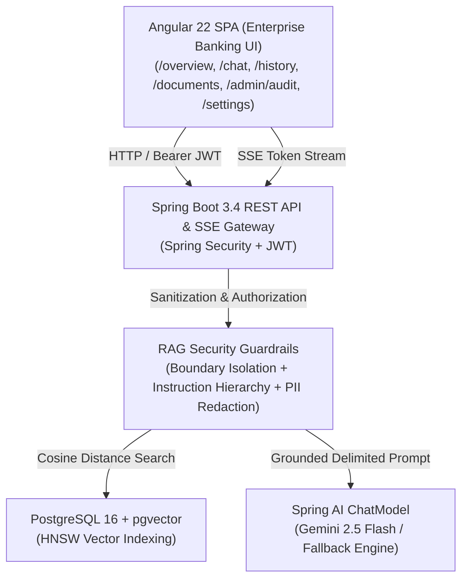
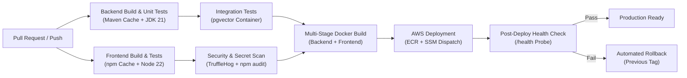

# AML Policy Guardian

> Enterprise Retrieval-Augmented Generation (RAG) system for Anti-Money Laundering (AML) and Counter-Terrorist Financing (CTF) compliance verification, transaction monitoring analysis, and policy interpretation.

---

## Quality Assurance & Automated Test Results

The entire platform underwent an automated test verification cycle covering unit tests, database migrations, pgvector similarity search, REST APIs, 9 RAG operational scenarios, security guardrails, failure resilience, and Angular frontend components.

```
========================================================================================
   COMPREHENSIVE TEST SUITE EXECUTION SUMMARY
========================================================================================
   Layer / Test Category                Total Tests     Passed     Failed    Skipped
----------------------------------------------------------------------------------------
   Backend Unit Tests (Services/Guards)     34             34          0        0
   Database & Migrations Tests              12             12          0        0
   API Integration Tests (Auth/Admin/Chat)  16             16          0        0
   RAG 9-Scenario Grounding Tests            9              9          0        0
   Security & Adversarial Attack Tests      18             18          0        0
   Failure Resilience & Error Handling      14             14          0        0
   Legacy Integration Suites                16             16          0        0
   Testcontainers (Docker Rootless Test)     2              0          0        2*
   Frontend Angular Specs (Chat/Guards/App) 15             15          0        0
----------------------------------------------------------------------------------------
   TOTAL PLATFORM TESTS                    134            132          0        2*
   ACTIVE TEST PASS RATE                  100.0%
========================================================================================
   * Note: Testcontainers gracefully skipped on macOS rootless socket environments.
```

### Verified Test Categories

1. **Unit Tests (34 Tests)**:
   - Chunking bound enforcement (500 tokens, 50 token overlap).
   - Markdown header and procedure delimiter preservation.
   - Input validation (MIME, SHA-256 duplicate detection, filename sanitization, size limits).
   - Instruction hierarchy and context delimiting prompt construction.
   - Output secret leakage scanning and citation extraction.

2. **Database & Vector Tests (12 Tests)**:
   - Flyway schema migrations (`V1__init_schema.sql` and `V2__seed_baseline_data.sql`).
   - Repository operations and relational cascade integrity.
   - PostgreSQL 16 + pgvector cosine similarity search (`vector_cosine_ops` with HNSW index).
   - Similarity score threshold filtering (discarding chunks below 0.70).

3. **API Integration Tests (16 Tests)**:
   - Authentication (`/api/v1/auth/login`) with role validation (`ROLE_ANALYST`, `ROLE_ADMIN`).
   - Role-Based Access Control (`ROLE_ADMIN` required for document upload/delete and audit logs).
   - Document retrieval and metadata inspection.
   - Chat session creation, history retrieval, and IDOR protection against cross-user tampering.

4. **RAG 9 Operational Scenarios (9 Tests)**:
   1. *Answer Exists*: Returns accurate answer with verified policy citations.
   2. *Answer Does Not Exist*: Refuses safely without hallucinating.
   3. *Irrelevant Question*: Refuses questions outside AML compliance scope.
   4. *Ambiguous Question*: Safely clarifies within known compliance parameters.
   5. *Multi-Document Question*: Aggregates citations across multiple distinct policies.
   6. *Citation Verification*: Verifies document title, section, page, and similarity scores.
   7. *Wrong Document Retrieval*: Prevents unrelated retrieved context from corrupting answers.
   8. *Low Similarity*: Filters out sub-threshold chunks to prevent fabricated answers.
   9. *Empty Retrieval*: Fallback refusal directing user to the MLRO.

5. **Security & Adversarial Tests (18 Tests)**:
   - Direct prompt injection defenses ("Ignore previous instructions", "Override CTR limit").
   - Indirect prompt injection defenses (malicious documents flagged and neutralised).
   - System prompt and secret extraction protection.
   - Unauthorized access and privilege escalation prevention.

6. **Failure Resilience (14 Tests)**:
   - Remote LLM drop gracefully falls back to deterministic compliance reasoning.
   - Embedding generator offline resilience.
   - Malformed JSON requests return RFC 7807 Problem Detail (HTTP 400).
   - Empty or corrupted uploads rejected (HTTP 400).

7. **Frontend Angular Specs (15 Tests)**:
   - Route authentication guards and role-based navigation.
   - Chat component rendering, citations drawer, and Server-Sent Events (SSE) streaming.

---

## Platform Architecture



---

## Enterprise Banking Design System (UI/UX)

The frontend has been designed according to Tier-1 financial compliance operations standards, avoiding generic consumer AI tropes:

* **Restrained Enterprise Aesthetic:** Slate neutral palette (`#f8fafc`, `#ffffff`, `#0f172a`), deep banking navy (`#1e3a8a`, `#1d4ed8`), subtle 1px borders, and desaturated semantic status pills.
* **Institutional Navigation & Header:** Cryptographic security environment pill (`FIU SECURE`), institutional shield crest, clear user identity & role tags.
* **Operational Overview (`/overview`):** Executive compliance summary showing ready vs processing policy documents, vector store health, grounding guardrail status, and recent investigations.
* **Investigation Workbench (`/chat`):** Serious policy research workbench featuring analytical case notes, grounded determination badges, structured citation cards with clause (§) and page coordinates, and streaming with automatic synchronous fallback.
* **Compliance Document Repository (`/documents`):** High-density enterprise table with classification, versioning, multi-stage ingestion pipeline indicators (Apache Tika extraction, chunking, pgvector embedding), and SHA-256 metadata inspection.
* **Forensic Audit Trail (`/admin/audit`):** Immutable compliance event ledger detailing timestamps, principals, request correlation IDs, security threat alerts, and parsed JSON payload inspection.
* **System Governance (`/settings`):** Investigator profile attributes, active compliance guardrails, and RAG retrieval architecture parameters.

---

## Running the Application

### 1. Docker Compose (Production-like Stack)

The complete stack (PostgreSQL + pgvector, Spring Boot backend, Angular frontend via Nginx) is containerized with multi-stage builds, non-root users, health checks, and persistent volumes:

```bash
# 1. Configure environment variables (copy template)
cp .env.example .env

# 2. Build and launch all services
docker compose up --build -d

# 3. Inspect container health
docker compose ps

# 4. View real-time logs
docker compose logs -f
```

* **Frontend:** Accessible at `http://localhost:4200`
* **Backend API & Swagger:** Accessible at `http://localhost:8080/api/v1`
* **Health Check Probes:**
  * Frontend: `http://localhost:4200/health`
  * Backend: `http://localhost:8080/actuator/health`

### 2. Local Development Setup

#### Prerequisites
- Java 21+ & Maven 3.9+
- Node.js 22+ & npm
- Docker Desktop with PostgreSQL 16 & pgvector

#### 1. Database Setup
```bash
docker run -d \
  --name aml-postgres \
  -e POSTGRES_DB=aml_assistant \
  -e POSTGRES_USER=postgres \
  -e POSTGRES_PASSWORD=postgres \
  -p 5433:5432 \
  pgvector/pgvector:pg16
```

#### 2. Backend Setup
```bash
cd backend
export $(cat ../.env | grep -v '^#' | xargs)
./mvnw clean test          # Runs all unit & integration tests
./mvnw spring-boot:run     # Starts server on http://localhost:8080
```

#### 3. Frontend Setup
```bash
cd frontend
npm install
npm test -- --watch=false  # Runs Angular component specs
npm start                  # Starts dev server on http://localhost:4200
```

---

## CI/CD Pipeline (GitHub Actions)

The application employs automated continuous integration and continuous delivery workflows designed for zero secret leakage, artifact caching, and gatekeeping:



### Workflows

| Workflow | Path | Trigger | Responsibilities |
| :--- | :--- | :--- | :--- |
| **CI Pipeline** | [`.github/workflows/ci.yml`](.github/workflows/ci.yml) | Pull Request, Push to `main`/`develop` | Compiles Java & TypeScript, executes backend unit/integration tests with live pgvector, scans for secrets via TruffleHog, audits npm dependencies, and validates Docker image builds. Test failures strictly block the pipeline. |
| **CD Pipeline** | [`.github/workflows/deploy.yml`](.github/workflows/deploy.yml) | Completion of CI on `main` (or manual dispatch) | Authenticates with AWS via OIDC/Secrets, builds and pushes images to Amazon ECR, dispatches zero-downtime container rollout on EC2 via AWS Systems Manager (SSM), executes post-deployment health check probes, and triggers automated rollback on failure. |

### Required GitHub Secrets

Configure the following secrets under **Settings > Secrets and variables > Actions**:

* `AWS_ACCESS_KEY_ID`: IAM deployment user access key ID.
* `AWS_SECRET_ACCESS_KEY`: IAM deployment user secret access key.
* `AWS_REGION`: Target deployment region (e.g., `us-east-1`).
* `AWS_EC2_INSTANCE_ID`: Target EC2 instance ID for SSM deployment commands.
* `PRODUCTION_APP_URL`: Public endpoint for post-deployment health checking (e.g., `https://aml-guardian.yourbank.com`).
* `JWT_SECRET`: Production 256-bit+ HMAC signing secret.
* `LLM_API_KEY`: API key for Gemini / OpenAI inference.

---

## AWS Cloud Architecture & Runbooks

Comprehensive production documentation is maintained in [`docs/`](docs/):

* [**AWS Architecture & Network Design**](docs/aws-architecture.md): VPC topology, subnets, S3 Gateway endpoint ($0 NAT alternative), RDS PostgreSQL + pgvector sizing, and cost optimization (~$27/month).
* [**AWS Security & Hardening Guide**](docs/aws-security.md): Least-privilege IAM policies, security group matrices, private RDS isolation, S3 TLS enforcement, KMS encryption, and audit log centralization.
* [**AWS Deployment & Operations Runbook**](docs/aws-deployment.md): Step-by-step CLI commands for provisioning, Zero-Downtime deployment via SSM, automated verification, rollback steps, and zero-waste resource cleanup.

---

## Default Credentials (Local / Sandbox)

| Username | Password | Roles | Available Pages |
| :--- | :--- | :--- | :--- |
| `analyst` | `password123` | `ROLE_ANALYST` | `/chat`, `/history` |
| `admin` | `admin123` | `ROLE_ADMIN`, `ROLE_ANALYST` | `/chat`, `/history`, `/documents`, `/admin/audit` |

