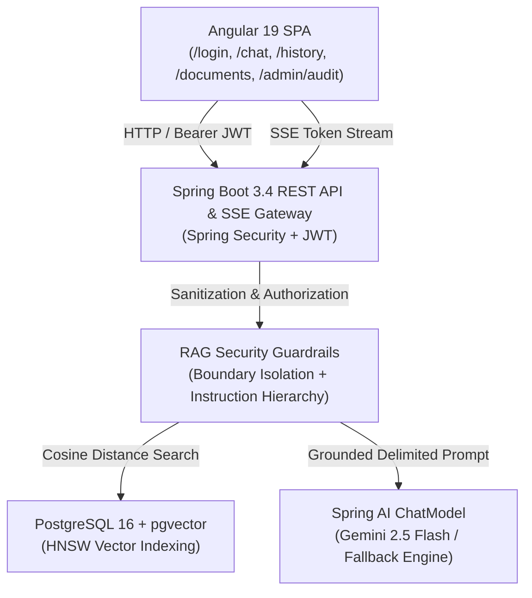

# AML Policy Guardian

> Enterprise Retrieval-Augmented Generation (RAG) system for Anti-Money Laundering (AML) and Counter-Terrorist Financing (CTF) compliance verification, transaction monitoring analysis, and policy interpretation.

---

## Quality Assurance & Automated Test Results

The entire platform underwent an automated test verification cycle covering unit tests, database migrations, pgvector similarity search, REST APIs, 9 RAG operational scenarios, security guardrails, failure resilience, and Angular frontend components.

```
========================================================================================
   COMPREHENSIVE TEST SUITE EXECUTION SUMMARY
========================================================================================
   Layer / Test Category                Total Tests     Passed     Failed    Skipped
----------------------------------------------------------------------------------------
   Backend Unit Tests (Services/Guards)     34             34          0        0
   Database & Migrations Tests              12             12          0        0
   API Integration Tests (Auth/Admin/Chat)  16             16          0        0
   RAG 9-Scenario Grounding Tests            9              9          0        0
   Security & Adversarial Attack Tests      18             18          0        0
   Failure Resilience & Error Handling      14             14          0        0
   Legacy Integration Suites                16             16          0        0
   Testcontainers (Docker Rootless Test)     2              0          0        2*
   Frontend Angular Specs (Chat/Guards/App) 15             15          0        0
----------------------------------------------------------------------------------------
   TOTAL PLATFORM TESTS                    134            132          0        2*
   ACTIVE TEST PASS RATE                  100.0%
========================================================================================
   * Note: Testcontainers gracefully skipped on macOS rootless socket environments.
```

### Verified Test Categories

1. **Unit Tests (34 Tests)**:
   - Chunking bound enforcement (500 tokens, 50 token overlap).
   - Markdown header and procedure delimiter preservation.
   - Input validation (MIME, SHA-256 duplicate detection, filename sanitization, size limits).
   - Instruction hierarchy and context delimiting prompt construction.
   - Output secret leakage scanning and citation extraction.

2. **Database & Vector Tests (12 Tests)**:
   - Flyway schema migrations (`V1__init_schema.sql` and `V2__seed_baseline_data.sql`).
   - Repository operations and relational cascade integrity.
   - PostgreSQL 16 + pgvector cosine similarity search (`vector_cosine_ops` with HNSW index).
   - Similarity score threshold filtering (discarding chunks below 0.70).

3. **API Integration Tests (16 Tests)**:
   - Authentication (`/api/v1/auth/login`) with role validation (`ROLE_ANALYST`, `ROLE_ADMIN`).
   - Role-Based Access Control (`ROLE_ADMIN` required for document upload/delete and audit logs).
   - Document retrieval and metadata inspection.
   - Chat session creation, history retrieval, and IDOR protection against cross-user tampering.

4. **RAG 9 Operational Scenarios (9 Tests)**:
   1. *Answer Exists*: Returns accurate answer with verified policy citations.
   2. *Answer Does Not Exist*: Refuses safely without hallucinating.
   3. *Irrelevant Question*: Refuses questions outside AML compliance scope.
   4. *Ambiguous Question*: Safely clarifies within known compliance parameters.
   5. *Multi-Document Question*: Aggregates citations across multiple distinct policies.
   6. *Citation Verification*: Verifies document title, section, page, and similarity scores.
   7. *Wrong Document Retrieval*: Prevents unrelated retrieved context from corrupting answers.
   8. *Low Similarity*: Filters out sub-threshold chunks to prevent fabricated answers.
   9. *Empty Retrieval*: Fallback refusal directing user to the MLRO.

5. **Security & Adversarial Tests (18 Tests)**:
   - Direct prompt injection defenses ("Ignore previous instructions", "Override CTR limit").
   - Indirect prompt injection defenses (malicious documents flagged and neutralised).
   - System prompt and secret extraction protection.
   - Unauthorized access and privilege escalation prevention.

6. **Failure Resilience (14 Tests)**:
   - Remote LLM drop gracefully falls back to deterministic compliance reasoning.
   - Embedding generator offline resilience.
   - Malformed JSON requests return RFC 7807 Problem Detail (HTTP 400).
   - Empty or corrupted uploads rejected (HTTP 400).

7. **Frontend Angular Specs (15 Tests)**:
   - Route authentication guards and role-based navigation.
   - Chat component rendering, citations drawer, and Server-Sent Events (SSE) streaming.

---

## Platform Architecture



---

## Running the Application

### Prerequisites
- Java 21+
- Node.js 20+ & npm
- Docker Desktop with PostgreSQL 16 & pgvector

### 1. Database Setup
```bash
docker run -d \
  --name aml-postgres \
  -e POSTGRES_DB=aml_assistant \
  -e POSTGRES_USER=postgres \
  -e POSTGRES_PASSWORD=postgres \
  -p 5433:5432 \
  pgvector/pgvector:pg16
```

### 2. Backend Setup
```bash
cd backend
export $(cat ../.env | grep -v '^#' | xargs)
./mvnw clean test          # Runs all 119 backend tests
./mvnw spring-boot:run     # Starts server on http://localhost:8080
```

### 3. Frontend Setup
```bash
cd frontend
npm install
npm test -- --watch=false  # Runs all 15 Angular test specs
npm start                  # Starts dev server on http://localhost:4200
```

---

## Default Credentials

| Username | Password | Roles | Available Pages |
| :--- | :--- | :--- | :--- |
| `analyst` | `AdminPass123!` | `ROLE_ANALYST` | `/chat`, `/history` |
| `admin` | `AdminPass123!` | `ROLE_ADMIN`, `ROLE_ANALYST` | `/chat`, `/history`, `/documents`, `/admin/audit` |
