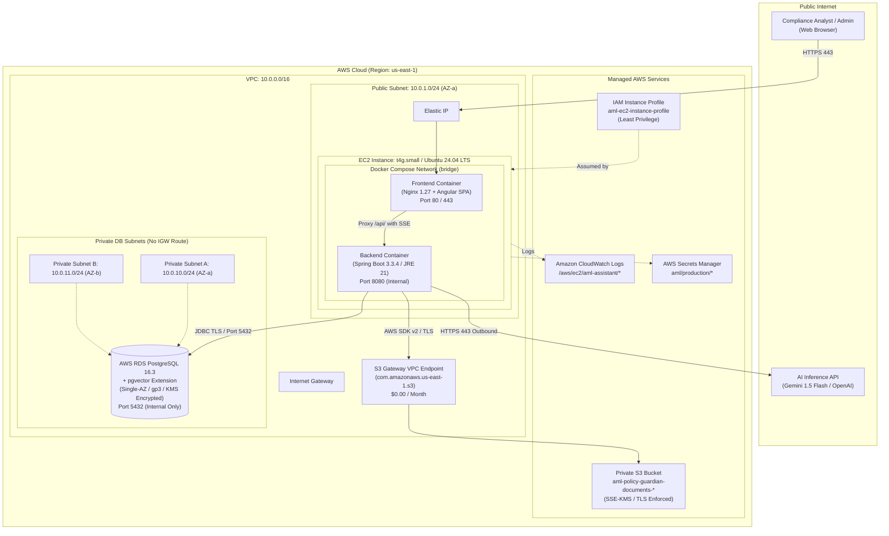

# AWS Architecture Design: AML Policy Guardian

## 1. Executive Summary

This document specifies the target production AWS architecture for the **AML Policy Guardian** RAG application. The design prioritizes **defense-in-depth security, regulatory data segregation, zero unnecessary costs, and strict least privilege**.

The system pairs a **Spring Boot 3.3.4 (Java 21)** backend with an **Angular 18** Single Page Application, backed by an isolated **AWS RDS PostgreSQL 16 instance with pgvector** for vector embeddings and metadata, an encrypted **Amazon S3** bucket for binary policy storage, and centralized **Amazon CloudWatch** logging.

---

## 2. High-Level Architecture Diagram



---

## 3. Network Design & Subnet Allocation

To eliminate the recurring cost of an AWS NAT Gateway (~$32.40/month per AZ + $0.045/GB data fees), the EC2 host resides in a public subnet with an Elastic IP and utilizes the **free S3 Gateway VPC Endpoint** for zero-cost, high-speed S3 document transfers. The RDS database is placed in **dedicated private subnets with no internet gateway route**.

| Subnet Identifier | CIDR Block | Availability Zone | Route Table | Purpose |
| :--- | :--- | :--- | :--- | :--- |
| `subnet-public-1a` | `10.0.1.0/24` | `us-east-1a` | `rtb-public` -> `igw-xxx` | Hosts EC2 instance (Frontend + Backend Docker) |
| `subnet-public-1b` | `10.0.2.0/24` | `us-east-1b` | `rtb-public` -> `igw-xxx` | Reserved for future Multi-AZ / ALB load balancer |
| `subnet-private-db-1a` | `10.0.10.0/24` | `us-east-1a` | `rtb-private` (Local only) | RDS PostgreSQL Primary Subnet |
| `subnet-private-db-1b` | `10.0.11.0/24` | `us-east-1b` | `rtb-private` (Local only) | RDS PostgreSQL Subnet Group Requirement |

### VPC Endpoints
* **S3 Gateway Endpoint (`com.amazonaws.us-east-1.s3`):**
  * Associated with `rtb-public` and `rtb-private`.
  * Guarantees all traffic from EC2 to S3 routes through AWS internal fabric without touching public internet.
  * Cost: **$0.00 / month**.

---

## 4. Security Group Ingress / Egress Matrix

Security groups implement strict least-privilege boundary filtering:

### 1. `sg-aml-ec2` (Application Host)
* **Ingress:**
  * `TCP 80` (HTTP) from `0.0.0.0/0` (Redirected to 443 / ACME Let's Encrypt challenge).
  * `TCP 443` (HTTPS) from `0.0.0.0/0` (Public client access to Angular SPA).
  * `TCP 22` (SSH) — **DISABLED**. Access is managed exclusively via **AWS Systems Manager Session Manager** (IAM-authenticated, audit-logged, zero inbound open ports).
* **Egress:**
  * `TCP 5432` to `sg-aml-rds` (Database connection).
  * `HTTPS 443` to `0.0.0.0/0` (Outbound calls to Gemini/OpenAI API, AWS CloudWatch, AWS Secrets Manager, Ubuntu security patches).

### 2. `sg-aml-rds` (Database Security Group)
* **Ingress:**
  * `TCP 5432` restricted strictly to source security group `sg-aml-ec2`.
  * **ZERO** public IP CIDR entries (`0.0.0.0/0` is strictly forbidden).
* **Egress:**
  * Outbound traffic completely disabled (or default deny).

---

## 5. PostgreSQL & pgvector Compatibility on AWS RDS

### Compatibility Verification
* **PostgreSQL Engine:** PostgreSQL 16.3 (or 16.4) on Amazon RDS.
* **pgvector Support:**
  * AWS RDS natively supports `pgvector` extension versions `0.5.1` and `0.7.0` on PostgreSQL 16.1+.
  * Supported indexing: `ivfflat` and `hnsw` (hierarchical navigable small world graphs) for cosine distance (`vector_cosine_ops`), L2 distance, and inner product.
* **Parameter Group Configuration:**
  * Parameter Group: `aml-pg16-custom-params`
  * `rds.force_ssl = 1` (Forces SSL/TLS encryption for all JDBC connections).
  * `shared_preload_libraries = pgvector` (Optional in PG16, dynamically loaded).
* **Provisioning & Activation:**
  ```sql
  -- Executed via Flyway migration V1__init_schema.sql on boot
  CREATE EXTENSION IF NOT EXISTS vector;
  CREATE EXTENSION IF NOT EXISTS "uuid-ossp";
  CREATE EXTENSION IF NOT EXISTS "pgcrypto";
  ```
* **Public Access Setting:** `PubliclyAccessible: false` (Enforces that RDS endpoint resolves exclusively to private IP `10.0.10.x` inside the VPC).

---

## 6. S3 Storage Architecture for Policy Documents

To ensure durable, compliant document lifecycle storage:
* **Bucket Naming:** `aml-policy-guardian-documents-<account-id>-<region>`
* **Encryption at Rest:** Server-Side Encryption with AWS KMS (SSE-KMS) or AES256 (`aws:kms`).
* **Encryption in Transit:** Bucket Policy enforcing `aws:SecureTransport = true` (all non-HTTPS requests rejected).
* **Access Control:**
  * S3 Block Public Access enabled across all four controls.
  * Direct access allowed only to the EC2 IAM Instance Profile.
* **Versioning & Retention:**
  * S3 Object Versioning enabled for compliance auditability.
  * Lifecycle policy transitions non-current versions to Glacier Flexible Retrieval after 90 days.

---

## 7. Cost Optimization Strategy

To provide production capabilities while minimizing operating expenditure:

| Component | AWS Resource | Monthly Estimate | Cost Optimization Technique |
| :--- | :--- | :--- | :--- |
| **Compute** | EC2 `t4g.small` (ARM Graviton2, 2 vCPU, 2GB RAM) | ~$12.26 | 20% cheaper than x86, eligible for AWS Free Tier trial; hosts both containers |
| **Database** | RDS `db.t4g.micro` (PostgreSQL 16, 20GB gp3) | ~$14.60 | Single-AZ deployment; Free Tier eligible for 12 months |
| **Networking** | NAT Gateway Avoidance | **$0.00** | Saved ~$32.40/month by utilizing public subnet for EC2 + S3 Gateway Endpoint |
| **Storage** | S3 Standard (10GB) + KMS | ~$0.25 | Pay-as-you-go document storage |
| **Monitoring** | CloudWatch Logs (1GB ingestion) | **$0.00** | Within AWS Free Tier (5GB free ingestion/month) |
| **SSL/TLS** | Let's Encrypt / Certbot | **$0.00** | Zero-cost SSL automated via Nginx reverse proxy |
| **Total** | | **~$27.11 / mo** | Optimized for banking proof-of-concept / pilot |
